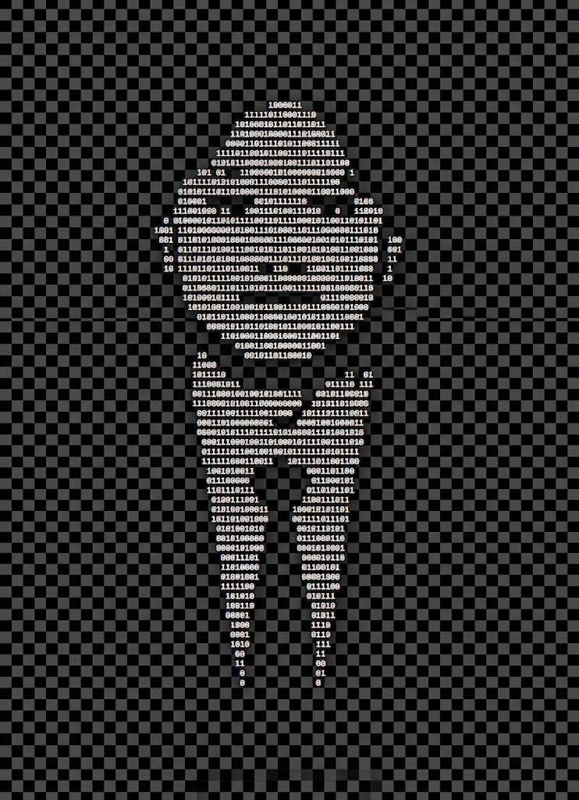

<!-- ═══════════════════════════════════════════════════════════════ -->
<!--                    AGUNG IMAN WICAKSONO · @AgvenZ             -->
<!-- ═══════════════════════════════════════════════════════════════ -->

<!-- ═══════════════════════════ HERO ═════════════════════════════ -->

  

 

 

<!-- ═══════════════════════════ ABOUT ME ═════════════════════════ -->

<h2>About Me</h2>

I'm a fresh graduate in **Informatics Engineering from Universitas Negeri Semarang** with a strong interest in **Full Stack Development**. I enjoy building web applications from the front end to the back end, whether it's creating clean and responsive interfaces or developing APIs and backend systems.

I like turning ideas into practical and user-friendly digital products while continuing to learn and improve my skills.

- 💻 **Focus:** Full Stack Web Development
- 🌱 **Currently Learning:** Modern web architecture and scalable applications
- 🎯 **Goal:** Becoming a professional Full Stack Developer

 

<!-- ═══════════════════════════ TECH STACK ═══════════════════════ -->

 

<h2>Tech Stack</h2>

 

<b>Languages</b>

  

  

<b>Frontend</b>

  

  

<b>Backend</b>

  

  

<b>Database &amp; Tools</b>

  

 

<!-- ═══════════════════════════ LET'S CONNECT ═══════════════════ -->

 

<h2>Let's Connect</h2>

Feel free to reach out if you'd like to talk about web development, tech, or anything else.

 

